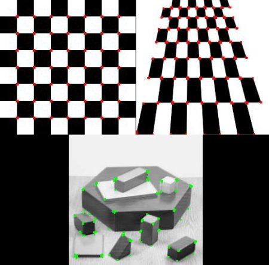
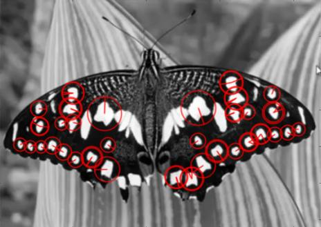
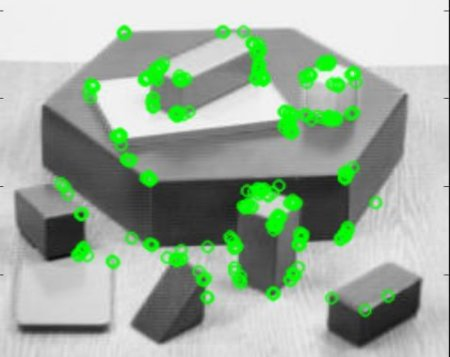
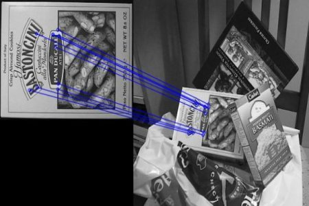
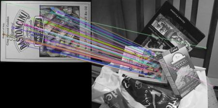
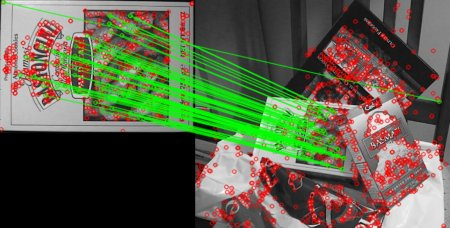
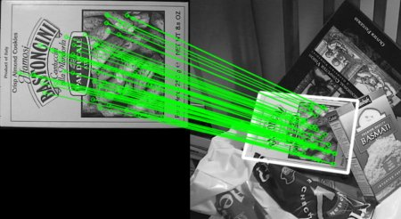

# OpenCV Python Feature Detection Cheatsheet

Author: methylDragon  
Contains a syntax reference and code snippets for OpenCV for Python!  
Note that this document is more or less based on the tutorials on https://docs.opencv.org    
With some personal notes from me!    

------

## Pre-Requisites

### Required

- Python knowledge, this isn't a tutorial!
- OpenCV installed


## 1. Introduction

Not much of an introduction here. OpenCV is just really great!

Since this is a work in progress, it's not going to be very well organised.

```python
# These will have been assumed to have been run

import cv2 as cv2, cv
import numpy as np
```

If you need additional help or need a refresher on the parameters, feel free to use:

```python
help(cv.FUNCTION_YOU_NEED_HELP_WITH)
```


## 2. Feature Detection and Description

### Harris Corner Detection (Normal and Subpixel)

https://www.youtube.com/watch?v=vkWdzWeRfC4

#### **Normal**



output_image is a map of detections. The whiter the pixel, the stronger the detection.

```python
# output_image = cv.cornerHarris(img, window_size,
#                                sobel_aperture, harris_parameter,
#                                [ border_type)
```

**Try it out**

```python
import numpy as np
import cv2 as cv

img = cv.imread('test_img.jpg')
cv.namedWindow('Harris Corner Detection Test', cv.WINDOW_NORMAL)

def f(x=None):
    return

cv.createTrackbar('Harris Window Size', 'Harris Corner Detection Test', 5, 25, f)
cv.createTrackbar('Harris Parameter', 'Harris Corner Detection Test', 1, 100, f)
cv.createTrackbar('Sobel Aperture', 'Harris Corner Detection Test', 1, 14, f)
cv.createTrackbar('Detection Threshold', 'Harris Corner Detection Test', 1, 100, f)

gray = cv.cvtColor(img,cv.COLOR_BGR2GRAY)
gray = np.float32(gray)

img_bak = img

while True:
    img = img_bak.copy()

    window_size = cv.getTrackbarPos('Harris Window Size', 'Harris Corner Detection Test')
    harris_parameter = cv.getTrackbarPos('Harris Parameter', 'Harris Corner Detection Test')
    sobel_aperture = cv.getTrackbarPos('Sobel Aperture', 'Harris Corner Detection Test')
    threshold = cv.getTrackbarPos('Detection Threshold', 'Harris Corner Detection Test')

    sobel_aperture = sobel_aperture * 2 + 1

    if window_size <= 0:
        window_size = 1

    dst = cv.cornerHarris(gray, window_size, sobel_aperture, harris_parameter/100)

    # Result is dilated for marking the corners, not important
    dst = cv.dilate(dst,None)

    # Threshold for an optimal value, it may vary depending on the image.
    img[dst > threshold/100 * dst.max()] = [0, 0, 255]

    dst_show = cv.cvtColor(dst, cv.COLOR_GRAY2BGR)
    dst_show = (255*dst_show).astype(np.uint8)

    cv.imshow('Harris Corner Detection Test', np.hstack((img, dst_show)))

    if cv.waitKey(10) & 0xFF == 27:
        break

cv.destroyAllWindows()
```

#### **Subpixel**

It's really really accurate!

```python
# corners = cv.cornerSubPix(image, corners, winSize, zeroZone, criteria)
```

Where criteria is

```python
# criteria = (cv.TERM_CRITERIA_EPS + cv.TERM_CRITERIA_MAX_ITER, MAX_ITERATIONS, EPSILON)
```

**Try it out**

```python
import numpy as np
import cv2 as cv

img = cv.imread('test_img.jpg')
cv.namedWindow('Harris Corner Detection Test', cv.WINDOW_NORMAL)

def f(x=None):
    return

cv.createTrackbar('Harris Window Size', 'Harris Corner Detection Test', 5, 25, f)
cv.createTrackbar('Harris Parameter', 'Harris Corner Detection Test', 1, 100, f)
cv.createTrackbar('Sobel Aperture', 'Harris Corner Detection Test', 1, 14, f)
cv.createTrackbar('Detection Threshold', 'Harris Corner Detection Test', 1, 100, f)

gray = cv.cvtColor(img,cv.COLOR_BGR2GRAY)
gray = np.float32(gray)

img_bak = img

while True:
    img = img_bak.copy()

    window_size = cv.getTrackbarPos('Harris Window Size', 'Harris Corner Detection Test')
    harris_parameter = cv.getTrackbarPos('Harris Parameter', 'Harris Corner Detection Test')
    sobel_aperture = cv.getTrackbarPos('Sobel Aperture', 'Harris Corner Detection Test')
    threshold = cv.getTrackbarPos('Detection Threshold', 'Harris Corner Detection Test')

    sobel_aperture = sobel_aperture * 2 + 1

    if window_size <= 0:
        window_size = 1

    dst = cv.cornerHarris(gray, window_size, sobel_aperture, harris_parameter/100)

    # Threshold for an optimal value, it may vary depending on the image.
    _ , dst_thresh = cv.threshold(dst, threshold/100 * dst.max(), 255, 0)
    dst_thresh = np.uint8(dst_thresh)

    dst_show = cv.cvtColor(dst, cv.COLOR_GRAY2BGR)
    dst_show = np.uint8(dst_show)

    ## REFINE CORNERS HERE!

    # find centroids
    ret, labels, stats, centroids = cv.connectedComponentsWithStats(dst_thresh)

    # define the criteria to stop and refine the corners
    criteria = (cv.TERM_CRITERIA_EPS + cv.TERM_CRITERIA_MAX_ITER, 100, 0.001)
    corners = cv.cornerSubPix(gray, np.float32(centroids), (5,5), (-1,-1), criteria)

    try:
        # Now draw them
        corners = np.int0(corners)

        img[corners[:, 1], corners[:, 0]] = [0, 255, 0]
        img[dst_thresh > 1] = [0, 0, 255]

    except:
        pass

    cv.imshow('Harris Corner Detection Test', np.hstack((img, dst_show)))

    if cv.waitKey(10) & 0xFF == 27:
        break

cv.destroyAllWindows()
```


### Shi-Tomasi Corner Detection (Better than Harris)

**These corner detectors are very good for finding point features for single point tracking!**

It's Harris with some small changes! It has a really creative name in OpenCV. \*snrk\*

http://aishack.in/tutorials/shitomasi-corner-detector/


```python
# corners = cv.goodFeaturesToTrack(image, maxCorners, qualityLevel, minDistance
#                                  [, corners, mask, blockSize, useHarrisDetector, k)

# maxCorners: Max corners to return
# qualityLevel: Basically a threshold value (set depending on the detector)
# minDistance: Min euclidean distance between returned corners
# mask: ROI
```

**Try it out!**

```python
import numpy as np
import cv2 as cv

img = cv.imread('test_img.jpg')
cv.namedWindow('Shi-Tomasi Corner Detection Test', cv.WINDOW_NORMAL)

def f(x=None):
    return

cv.createTrackbar('Max Corners', 'Shi-Tomasi Corner Detection Test', 25, 100, f)
cv.createTrackbar('Threshold', 'Shi-Tomasi Corner Detection Test', 39, 100, f)
cv.createTrackbar('Min Distance', 'Shi-Tomasi Corner Detection Test', 7, 14, f)

gray = cv.cvtColor(img,cv.COLOR_BGR2GRAY)
gray = np.float32(gray)

img_bak = img

while True:
    img = img_bak.copy()

    max_corners = cv.getTrackbarPos('Max Corners', 'Shi-Tomasi Corner Detection Test')
    threshold = cv.getTrackbarPos('Threshold', 'Shi-Tomasi Corner Detection Test') / 100
    min_distance = cv.getTrackbarPos('Min Distance', 'Shi-Tomasi Corner Detection Test')

    if threshold <= 0:
        threshold = 0.001

    corners = cv.goodFeaturesToTrack(gray, max_corners, threshold, min_distance)
    corners = np.int0(corners)

    for i in corners:
        x,y = i.ravel()
        cv.circle(img,(x,y), 2, (0, 255, 0), -1)

    cv.imshow('Shi-Tomasi Corner Detection Test', img)

    if cv.waitKey(10) & 0xFF == 27:
        break

cv.destroyAllWindows()
```


### Key Points

The next few sections will feature (pun unintended) keypoint detectors.

In Python the keypoint objects are defined as such

```python
# Either
cv.KeyPoint(x, y, _size[, _angle[, _response[, _octave[, _class_id]]]])

# Or have the following members
angle
class_id
convert()
octave
overlap()
pt
response
size
```

As they usually come in lists, you may also convert them using this:

```python
points2f = cv.KeyPoint_convert(keypoints[, keypointIndexes])
```

Once you find the keypoints, you can then compute descriptors for them that you can use later on to match the keypoints of other images.


### FAST Algorithm for Corner Detection

https://docs.opencv.org/3.4.4/df/d0c/tutorial_py_fast.html

FAST (Features from Accelerated Segment Test). It's really fast! Good for SLAM.

Note that it's not robust to high levels of noise. For details on the algorithm check the doc link.

```python
# detector = cv.FastFeatureDetector_create([, threshold, nonmaxSuppression, type)
```

**Try it out!**

```python
import numpy as np
import cv2 as cv

img = cv.imread('test_img.jpg')

# Initiate FAST object with default values
fast = cv.FastFeatureDetector_create(threshold = 50000)

# find and draw the keypoints
kp = fast.detect(img,None)
img2 = cv.drawKeypoints(img, kp, None, color=(255,0,0))

# Print all default params
print( "Threshold: {}".format(fast.getThreshold()) )
print( "nonmaxSuppression:{}".format(fast.getNonmaxSuppression()) )
print( "neighborhood: {}".format(fast.getType()) )
print( "Total Keypoints with nonmaxSuppression: {}".format(len(kp)) )

# Disable nonmaxSuppression
fast.setNonmaxSuppression(0)
kp = fast.detect(img,None)

print( "Total Keypoints without nonmaxSuppression: {}".format(len(kp)) )
img3 = cv.drawKeypoints(img, kp, None, color=(255,0,0))

cv.imshow('FAST with suppression', img2)
cv.imshow('FAST no suppression', img3)

cv.waitKey(0)
cv.destroyAllWindows()
```


### SIFT (Scale-Invariant Feature Transform)

http://aishack.in/tutorials/sift-scale-invariant-feature-transform-introduction/

The way it gets scale invariant is by using image pyramids! After that keypoints (found via difference of gaussians) are localised to the subpixel and compared across the different scales. **That's how you get scale invariance.**

Keypoints are then removed according to a threshold, and then assigned orientations (with a 36 bin orientation histogram).

The 16x16 pixel neighbourhood around the keypoint  are split into 4x4 size sub-blocks (16 in total), that are also given orientations as an 8 bin orientation histogram. **That's how you get rotation invariance.**

The feature are these keypoints with their neighbourhood pixel orientations rotated by the keypoint's specific orientation, represented as vectors! (The neighbourhood pixel sub-blocks are described in total by 128 orientation histogram bins. THIS is the feature, after you rotate them by the keypoint's overall orientation.)

Hard to explain, just look at the link above.

**NOTE: This algorithm is patented. You must install openCV_contrib.**

**Using SIFT**

Note: Image should be grayscale

Key_points: Is a list of keypoints

Descriptor: Is an array of size len(key_points) x 128

```python
# First create the detector
sift = cv.xfeatures2d.SIFT_create()

# Then use it!
key_points = sift.detect(img, None)
descriptor = sift.compute(img, key_points)

# Or if you want to do it in a single step
key_points, descriptor = sift.detectAndCompute(image)
```

**Keypoint Detector Parameters**

https://docs.opencv.org/3.4/d5/d3c/classcv_1_1xfeatures2d_1_1SIFT.html

-  **nfeatures** : The number of best features to retain. The features are ranked by their scores (measured in [SIFT](https://docs.opencv.org/3.4/d5/d3c/classcv_1_1xfeatures2d_1_1SIFT.html) algorithm as the local contrast)

- **nOctaveLayers** : The number of layers in each octave. 3 is the value used in D. Lowe paper. The number of octaves is computed automatically from the image resolution.
- **contrastThreshold** : The contrast threshold used to filter out weak features in semi-uniform (low-contrast) regions. The larger the threshold, the less features are produced by the detector.
- **edgeThreshold** : The threshold used to filter out edge-like features. Note that the its meaning is different from the contrastThreshold, i.e. the larger the edgeThreshold, the less features are filtered out (more features are retained). |
- **sigma** : The sigma of the Gaussian applied to the input image at the octave #0. If your image is captured with a weak camera with soft lenses, you might want to reduce the number. |

```python
# retval = cv.xfeatures2d.SIFT_create([, nfeatures, nOctaveLayers, contrastThreshold,
#                                      edgeThreshold, sigma)
```

**Example**

```python
import numpy as np
import cv2 as cv

img = cv.imread('test_img.jpg')
gray= cv.cvtColor(img,cv.COLOR_BGR2GRAY)

sift = cv.xfeatures2d.SIFT_create()
kp = sift.detect(gray,None)

# Draw without orientations
#img=cv.drawKeypoints(gray,kp,img)

img=cv.drawKeypoints(gray,kp,img,flags=cv.DRAW_MATCHES_FLAGS_DRAW_RICH_KEYPOINTS)

cv.imshow('SIFT', img)

cv.waitKey(0)
cv.destroyAllWindows()
```


### SURF (Speeded Up Robust Features)

https://docs.opencv.org/3.4.4/df/dd2/tutorial_py_surf_intro.html

It's an improvement of SIFT! Not exactly sure how it works. It's about 3 times as fast with comparable performance.

It's not good at handling viewpoint change and illumination change though.

**SURF is also patented**



```python
# In this case the higher the threshold, the fewer detections you'll get
surf = cv.xfeatures2d.SURF_create(threshold) 
kp, des = surf.detectAndCompute(img, None)

# Check threshold
surf.getHessianThreshold()

# Set threshold
surf.setHessianThreshold(300) # 300-500 is good for pictures, 50000 for display and debug

# Draw
img = cv.drawKeypoints(img,kp,None,(255,0,0),4)
```

**More Settings**


```python
# Ignore orientation (Good if you know your image orientation won't change)
surf.setUpright(True) # It'll speed up!

# Increase descriptor resolution/size
surf.setExtended(True) # You'll go from the default 64 descriptors to 128
```


### BRIEF (Binary Robust Independent Elementary Features)

https://docs.opencv.org/3.4.4/dc/d7d/tutorial_py_brief.html

BRIEF is a feature descriptor, it speeds up computation of descriptors (not finding of keypoints!)

You need to use a separate detector before you can use BRIEF as a result. It's quite robust unless there is large in-plane rotation.

```python
# Create BRIEF extractor
brief = cv.xfeatures2d.BriefDescriptorExtractor_create()

# Compute descriptors
kp, des = brief.compute(img, kp)
```

**Try it out!**

```python
# Source: https://docs.opencv.org/3.4.4/dc/d7d/tutorial_py_brief.html

import numpy as np
import cv2 as cv

img = cv.imread('test_img.jpg',0)

# Initiate FAST detector
star = cv.xfeatures2d.StarDetector_create()

# Initiate BRIEF extractor
brief = cv.xfeatures2d.BriefDescriptorExtractor_create()

# find the keypoints with STAR
kp = star.detect(img,None)

# compute the descriptors with BRIEF
kp, des = brief.compute(img, kp)

print( brief.descriptorSize() )
print( des.shape )
cv.imshow("test", kp)
cv.waitKey(0)
cv.destroyAllWindows
```


### ORB (Oriented FAST and Rotated BRIEF)

Good alternative to SIFT SURF that isn't patented!

Details here: https://docs.opencv.org/3.4.4/d1/d89/tutorial_py_orb.html



**Detector Parameters**

https://docs.opencv.org/3.4.4/db/d95/classcv_1_1ORB.html

| Parameter     | Description |
| ------------- | ------------------------------------------------------------ |
| nfeatures     | The maximum number of features to retain.                    |
| scaleFactor   | Pyramid decimation ratio, greater than 1. scaleFactor==2 means the classical pyramid, where each next level has 4x less pixels than the previous, but such a big scale factor will degrade feature matching scores dramatically. On the other hand, too close to 1 scale factor will mean that to cover certain scale range you will need more pyramid levels and so the speed will suffer. |
| nlevels       | The number of pyramid levels. The smallest level will have linear size equal to input_image_linear_size/pow(scaleFactor, nlevels - firstLevel). |
| edgeThreshold | This is size of the border where the features are not detected. It should roughly match the patchSize parameter. |
| firstLevel    | The level of pyramid to put source image to. Previous layers are filled with upscaled source image. |
| WTA_K         | The number of points that produce each element of the oriented BRIEF descriptor. The default value 2 means the BRIEF where we take a random point pair and compare their brightnesses, so we get 0/1 response. Other possible values are 3 and 4. For example, 3 means that we take 3 random points (of course, those point coordinates are random, but they are generated from the pre-defined seed, so each element of BRIEF descriptor is computed deterministically from the pixel rectangle), find point of maximum brightness and output index of the winner (0, 1 or 2). Such output will occupy 2 bits, and therefore it will need a special variant of [Hamming](https://docs.opencv.org/3.4.4/d3/d59/structcv_1_1Hamming.html) distance, denoted as NORM_HAMMING2 (2 bits per bin). When WTA_K=4, we take 4 random points to compute each bin (that will also occupy 2 bits with possible values 0, 1, 2 or 3). |
| scoreType     | The default HARRIS_SCORE means that Harris algorithm is used to rank features (the score is written to KeyPoint::score and is used to retain best nfeatures features); FAST_SCORE is alternative value of the parameter that produces slightly less stable keypoints, but it is a little faster to compute. |
| patchSize     | size of the patch used by the oriented BRIEF descriptor. Of course, on smaller pyramid layers the perceived image area covered by a feature will be larger. |

```python
# detector = cv.ORB_create([, nfeatures, scaleFactor, nlevels,
#                          edgeThreshold, firstLevel, WTA_K, scoreType,
#                          patchSize, fastThreshold)

orb = cv.ORB_create(edgeThreshold=15, patchSize=31, nlevels=8, fastThreshold=20, scaleFactor=1.2, WTA_K=2,scoreType=cv.ORB_HARRIS_SCORE, firstLevel=0, nfeatures=500)
```

**Try it out!**

```python
import numpy as np
import cv2 as cv

img = cv.imread('test_img.jpg')

cv.namedWindow('ORB', cv.WINDOW_NORMAL)

def f(x):
    return

# Initiate ORB detector
cv.createTrackbar('Edge Threshold', 'ORB', 15, 50, f)
cv.createTrackbar('Patch Size', 'ORB', 31, 30, f)
cv.createTrackbar('N Levels', 'ORB', 8, 30, f)
cv.createTrackbar('Fast Threshold', 'ORB', 20, 50, f)
cv.createTrackbar('Scale Factor', 'ORB', 12, 25, f)
cv.createTrackbar('WTA K', 'ORB', 2, 4, f)
cv.createTrackbar('First Level', 'ORB', 0, 20, f)
cv.createTrackbar('N Features', 'ORB', 500, 1000, f)

while True:
    edge_threshold = cv.getTrackbarPos('Edge Threshold', 'ORB')
    patch_size = cv.getTrackbarPos('Patch Size', 'ORB')
    n_levels = cv.getTrackbarPos('N Levels', 'ORB')
    fast_threshold = cv.getTrackbarPos('Fast Threshold', 'ORB')
    scale_factor = cv.getTrackbarPos('Scale Factor', 'ORB') / 10
    wta_k = cv.getTrackbarPos('WTA K', 'ORB')
    first_level = cv.getTrackbarPos('First Level', 'ORB')
    n_features = cv.getTrackbarPos('N Features', 'ORB')

    if wta_k < 2:
        wta_k = 2

    if patch_size < 2:
        patch_size = 2

    if n_levels < 1:
        n_levels = 1

    if scale_factor < 1:
        scale_factor = 1

    orb = cv.ORB_create(edgeThreshold=edge_threshold, patchSize=patch_size, nlevels=n_levels, fastThreshold=fast_threshold, scaleFactor=scale_factor, WTA_K=wta_k,scoreType=cv.ORB_HARRIS_SCORE, firstLevel=first_level, nfeatures=n_features)

    # find the keypoints with ORB
    kp = orb.detect(img,None)

    # compute the descriptors with ORB
    kp, des = orb.compute(img, kp)

    # draw only keypoints location,not size and orientation
    img2 = cv.drawKeypoints(img, kp, None, color=(0,255,0), flags=cv.DRAW_MATCHES_FLAGS_DRAW_RICH_KEYPOINTS)

    cv.imshow('ORB', img2)

    if cv.waitKey(10) & 0xFF == 27:
        break

cv.destroyAllWindows()
```


### Final Notes on Detectors

> This article presents an exhaustive comparison of SIFT, SURF, KAZE, AKAZE, ORB, and BRISK feature-detector-descriptors. The experimental results provide rich information and various new insights that are valuable for making critical decisions in vision based applications. SIFT, SURF, and BRISK are found to be the most scale invariant feature detectors (on the basis of repeatability) that have survived wide spread scale variations. ORB is found to be least scale invariant. ORB(1000), BRISK(1000), and AKAZE are more rotation invariant than others. ORB and BRISK are generally more invariant to affine changes as compared to others. SIFT, KAZE, AKAZE, and BRISK have higher accuracy for image rotations as compared to the rest. Although, ORB and BRISK are the most efficient algorithms that can detect a huge amount of features, the matching time for such a large number of features prolongs the *total image matching time*. On the contrary, ORB(1000) and BRISK(1000) perform fastest image matching but their accuracy gets compromised. The overall accuracy of SIFT and BRISK is found to be highest for all types of geometric transformations and SIFT is concluded as the most accurate algorithm.
>
> https://ieeexplore.ieee.org/document/8346440/all-figures


## 3. Feature Matching

In the previous section, we went through how to get keypoints, and compute the descriptors for those keypoints. Now we'll learn how to use them!

### Brute Force Matching

Norm Types:

- **cv.NORM_L2** : For SIFT, SURF
- **cv.NORM_HAMMING** : ORB, BRIEF, BRISK, etc.
- **cv.NORM_HAMMING2** : ORB if WTA_K is 3 or 4

You should also turn on crossCheck for better results

```python
# Create Brute Force Matcher
matcher = cv.BFMatcher([, normType[, crossCheck]])
```
**Draw Matches**

| Parameter | Description |
| ---------------- | ------------------------------------------------------------ |
| img1             | First source image.                                          |
| keypoints1       | Keypoints from the first source image.                       |
| img2             | Second source image.                                         |
| keypoints2       | Keypoints from the second source image.                      |
| matches1to2      | Matches from the first image to the second one, which means that keypoints1[i] has a corresponding point in keypoints2[matches[i]] . |
| outImg           | Output image. Its content depends on the flags value defining what is drawn in the output image. See possible flags bit values below. |
| matchColor       | Color of matches (lines and connected keypoints). If matchColor==[Scalar::all](https://docs.opencv.org/3.4.4/d1/da0/classcv_1_1Scalar__.html#ac1509a4b8454fe7fe29db069e13a2e6f)(-1) , the color is generated randomly. |
| singlePointColor | Color of single keypoints (circles), which means that keypoints do not have the matches. If singlePointColor==[Scalar::all](https://docs.opencv.org/3.4.4/d1/da0/classcv_1_1Scalar__.html#ac1509a4b8454fe7fe29db069e13a2e6f)(-1) , the color is generated randomly. |
| matchesMask      | Mask determining which matches are drawn. If the mask is empty, all matches are drawn. |
| flags            | Flags setting drawing features. Possible flags bit values are defined by [DrawMatchesFlags](https://docs.opencv.org/3.4.4/de/d30/structcv_1_1DrawMatchesFlags.html). |

```python
# Find matches
matches = bf.match(des1,des2)
matches = bf.knnMatch(des1,des2, k=2)

# Draw matches (draws the top match for each keypoint)
outImg = cv.drawMatches(img1, keypoints1, img2, keypoints2, matches1to2, 
                        outImg[,matchColor, singlePointColor, matchesMask, flags)

# Draw K best matches draws K lines from each keypoint to each matched point
outImg = cv.drawMatchesKnn(img1, keypoints1, img2, keypoints2, matches1to2,
                           outImg[, matchColor, singlePointColor, matchesMask, flags)
                                  
# Flags:
# DEFAULT = 0 
# DRAW_OVER_OUTIMG = 1 
# NOT_DRAW_SINGLE_POINTS = 2 
# DRAW_RICH_KEYPOINTS = 4
```

**Normal Usage**



```python
# Source: https://docs.opencv.org/3.4.4/dc/dc3/tutorial_py_matcher.html

import numpy as np
import cv2 as cv
import matplotlib.pyplot as plt

img1 = cv.imread('box.png',0)          # queryImage
img2 = cv.imread('box_in_scene.png',0) # trainImage

# Initiate ORB detector
orb = cv.ORB_create()

# find the keypoints and descriptors with ORB
kp1, des1 = orb.detectAndCompute(img1,None)
kp2, des2 = orb.detectAndCompute(img2,None)

## Draw Top Matches

# create BFMatcher object
bf = cv.BFMatcher(cv.NORM_HAMMING, crossCheck=True)

# Match descriptors.
matches = bf.match(des1,des2)

# Sort them in the order of their distance.
matches = sorted(matches, key = lambda x:x.distance)

# Draw first 10 matches.
img3 = cv.drawMatches(img1,kp1,img2,kp2,matches[:10], None, flags=2)
```

> **Notes on result of bf.match()**
>
> The result of matches = bf.match(des1,des2) line is a list of DMatch objects. This DMatch object has following attributes:
>
> - DMatch.distance - Distance between descriptors. The lower, the better it is.
> - DMatch.trainIdx - Index of the descriptor in train descriptors
> - DMatch.queryIdx - Index of the descriptor in query descriptors
> - DMatch.imgIdx - Index of the train image.

**knnMatch Usage**



In this example, K = 2. In other words, each keypoint on the query image has two match lines linking it to keypoints on the test image.

```python
# Source: https://docs.opencv.org/3.4.4/dc/dc3/tutorial_py_matcher.html

import numpy as np
import cv2 as cv
from matplotlib import pyplot as plt

img1 = cv.imread('box.png',0)          # queryImage
img2 = cv.imread('box_in_scene.png',0) # trainImage

# Initiate SIFT detector
sift = cv.SIFT()

# find the keypoints and descriptors with SIFT
kp1, des1 = sift.detectAndCompute(img1,None)
kp2, des2 = sift.detectAndCompute(img2,None)

# BFMatcher with default params
bf = cv.BFMatcher()
matches = bf.knnMatch(des1,des2, k=2)

# Apply ratio test
good = []
for m,n in matches:
    if m.distance < 0.75*n.distance:
        good.append([m])

# cv.drawMatchesKnn expects list of lists as matches.
img3 = cv.drawMatchesKnn(img1,kp1,img2,kp2,good,flags=2)
plt.imshow(img3),plt.show()
```


### FLANN Based Matcher (Fast Library for Approximate Nearest Neighbors)

It uses fast nearest neighbour search in large datasets. It's faster than the brute force matcher.

> For FLANN based matcher, we need to pass two dictionaries which specifies the algorithm to be used, its related parameters etc. First one is IndexParams. For various algorithms, the information to be passed is explained in FLANN docs.

**For SIFT, SURF**

```python
FLANN_INDEX_KDTREE = 1
index_params = dict(algorithm = FLANN_INDEX_KDTREE, trees = 5)

# Then set number of searches. Higher is better, but takes longer
search_params = dict(checks=100)
```

**For ORB**

```python
FLANN_INDEX_LSH = 6
index_params= dict(algorithm = FLANN_INDEX_LSH,
                   table_number = 6, # 12
                   key_size = 12,     # 20
                   multi_probe_level = 1) #2

# Then set number of searches. Higher is better, but takes longer
search_params = dict(checks=100)
```

**Then initialise the matcher**

```python
flann = cv.FlannBasedMatcher(index_params,search_params)

# Find matches
matches = flann.match(des1,des2)
matches = flann.knnMatch(des1,des2, k=2)
```

**Try it out!**



```python
# Source: https://docs.opencv.org/3.4.4/dc/dc3/tutorial_py_matcher.html
import numpy as np
import cv2 as cv
from matplotlib import pyplot as plt

img1 = cv.imread('box.png',0)          # queryImage
img2 = cv.imread('box_in_scene.png',0) # trainImage

# Initiate SIFT detector
sift = cv.SIFT()

# find the keypoints and descriptors with SIFT
kp1, des1 = sift.detectAndCompute(img1,None)
kp2, des2 = sift.detectAndCompute(img2,None)

# FLANN parameters
FLANN_INDEX_KDTREE = 1
index_params = dict(algorithm = FLANN_INDEX_KDTREE, trees = 5)
search_params = dict(checks=50)   # or pass empty dictionary
flann = cv.FlannBasedMatcher(index_params,search_params)
matches = flann.knnMatch(des1,des2,k=2)

# Need to draw only good matches, so create a mask
matchesMask = [[0,0] for i in xrange(len(matches))]

# ratio test as per Lowe's paper
for i,(m,n) in enumerate(matches):
    if m.distance < 0.7*n.distance:
        matchesMask[i]=[1,0]

draw_params = dict(matchColor = (0,255,0),
                   singlePointColor = (255,0,0),
                   matchesMask = matchesMask,
                   flags = 0)

img3 = cv.drawMatchesKnn(img1,kp1,img2,kp2,matches,None,**draw_params)
plt.imshow(img3,),plt.show()
```


### Feature Matching and Homography

https://docs.opencv.org/3.4.4/d1/de0/tutorial_py_feature_homography.html

Find the perspective transformation of the query image to the test image!



The basic idea is you use the knnMatch to find matches that are good enough.

Then you pass the good source and good destination points into cv.findHomography(), which runs a RANSAC or LEAST_MDIAN algorithm to obtain a transformation matrix.

You can pass that matrix into cv.perspectiveTransform() together with the corner points of the destination matrix to draw the projected source image in the destination image.

**Try it out!**

```python
# Source: https://docs.opencv.org/3.4.4/d1/de0/tutorial_py_feature_homography.html
# Slightly edited by methylDragon

import numpy as np
import cv2 as cv
from matplotlib import pyplot as plt

MIN_MATCH_COUNT = 10

img1 = cv.imread('test_img.jpg',0)          # queryImage
img2 = cv.imread('test_img_in_scene.jpg',0) # trainImage

# Initiate SIFT detector
orb = cv.ORB_create(edgeThreshold=15, patchSize=31, nlevels=8, fastThreshold=20, scaleFactor=1.2, WTA_K=2,scoreType=cv.ORB_HARRIS_SCORE, firstLevel=0, nfeatures=500)

# find the keypoints and descriptors with SIFT
kp1, des1 = orb.detectAndCompute(img1,None)
kp2, des2 = orb.detectAndCompute(img2,None)

FLANN_INDEX_LSH = 6
index_params= dict(algorithm = FLANN_INDEX_LSH,
                   table_number = 6, # 12
                   key_size = 12,     # 20
                   multi_probe_level = 1) #2

# Then set number of searches. Higher is better, but takes longer
search_params = dict(checks=100)

flann = cv.FlannBasedMatcher(index_params, search_params)
matches = flann.knnMatch(des1,des2,k=2)

# store all the good matches as per Lowe's ratio test.
good = []
for m,n in matches:
    if m.distance < 0.7*n.distance:
        good.append(m)

if len(good)>MIN_MATCH_COUNT:
    src_pts = np.float32([ kp1[m.queryIdx].pt for m in good ]).reshape(-1,1,2)
    dst_pts = np.float32([ kp2[m.trainIdx].pt for m in good ]).reshape(-1,1,2)

    M, mask = cv.findHomography(src_pts, dst_pts, cv.RANSAC,5.0)

    matchesMask = mask.ravel().tolist()

    try:
        h,w,d = img1.shape
    except:
        h, w = img1.shape

    pts = np.float32([ [0,0],[0,h-1],[w-1,h-1],[w-1,0] ]).reshape(-1,1,2)

    dst = cv.perspectiveTransform(pts,M)
    img2 = cv.polylines(img2,[np.int32(dst)],True,255,3, cv.LINE_AA)
else:
    print( "Not enough matches are found - {}/{}".format(len(good), MIN_MATCH_COUNT) )
    matchesMask = None

draw_params = dict(matchColor = (0,255,0), # draw matches in green color
                   singlePointColor = None,
                   matchesMask = matchesMask, # draw only inliers
                   flags = 2)

img3 = cv.drawMatches(img1,kp1,img2,kp2,good,None,**draw_params)
plt.imshow(img3, 'gray'),plt.show()
```


```
                            .     .
                         .  |\-^-/|  .    
                        /| } O.=.O { |\
```

​    

------

 [.png)](https://www.buymeacoffee.com/methylDragon)

