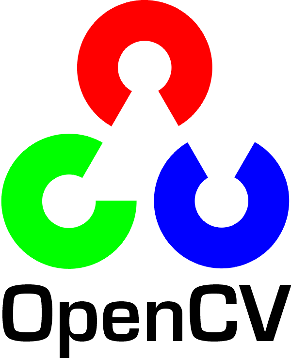

# opencv-python-reference
An (almost) fully comprehensive reference for OpenCV!

**Comes with Code Snippets, Resources, Pictures (Some are animated), Explanations, Parameter Descriptions, and more!**

---




Sometimes it's just nice to have everything you need, all the bits and pieces of code all easily retrievable from a single source. It's like making lego bricks for your code!

I found that this kind of pre-loading of all the retrieval work makes my workflow a lot more streamlined, and I save a lot of time for the time invested into preparing these references. It also makes it so that I'm forced to read through all the documentation and understand it.

So, here's a reference that covers almost every function and functionality in OpenCV!

**-CH3EERS**


## Support my efforts!

 [.png)](https://www.buymeacoffee.com/methylDragon)

[Or leave a tip! ヾ(°∇°*)](https://www.paypal.me/methylDragon)

---

## Reference Map

1. **Basics and Image Processing**
   - OpenCV Basic Commands
     - Windows, Operations, Drawing, Interaction
   - Basic Image Operations
   - Basic Image Processing
     - Transformations, Convolutions, Morphological Transformations,  Gradients, Pyramids
   - Advanced Image Processing
     - Canny, Histogram Equalisation, Hough Lines and Circles, Blob Detection, Denoising, Inpainting, Fourier, HDR, Template Matching, Watershed
   - Contours
   - Histograms
   - Saliency API
2. **Feature Detection and Description**
   - Harris Corner
   - Shi-Tomasi
   - Key Points
   - Keypoint Detectors
     - FAST
     - SIFT
     - SURF
     - BRIEF
     - ORB
     - Final Notes
   - Feature Matching
     - Brute Force
     - FLANN
     - Homography
3. **Video and Image Analysis, and Object Tracking**
   - Optical Flow
     - Lucas-Kanade
     - Dense
   - Background Subtraction
   - Camera Calibration
     - Camera Properties
     - Calibration
     - Undistortion
   - Pose Estimation
   - Depth Map
   - Meanshift
   - Camshift
   - Centroid Tracking
   - Single and Multi-Object Tracking
   - Single and Multi-Object Tracking with dlib (and Multiprocessing!)
   - Footfall Tracking
4. **Machine Learning and AI Detectors**
   - k-Nearest Neighbours (With OCR example)
   - K-Means Clustering (With Colour Quantisation example)
   - Support Vector Machines (With OCR example)
   - Non-maximum Suppression
   - Haar Cascades
   - Facial Landmarks with dlib
   - Caffe Face Detection
   - Loading Neural Nets with OpenCV
   - YOLO
   - Mask R-CNN
   - Applications
     - Face Recognition
     - Facial Clustering
5. **Optimisation**
   - Enabling optimisation
   - Measuring performance
   - Cython


## Credits

All credits and sources are listed inside the tutorials and references themselves.


```
                            .     .
                         .  |\-^-/|  .    
                        /| } O.=.O { |\
```